# MCUVoltage

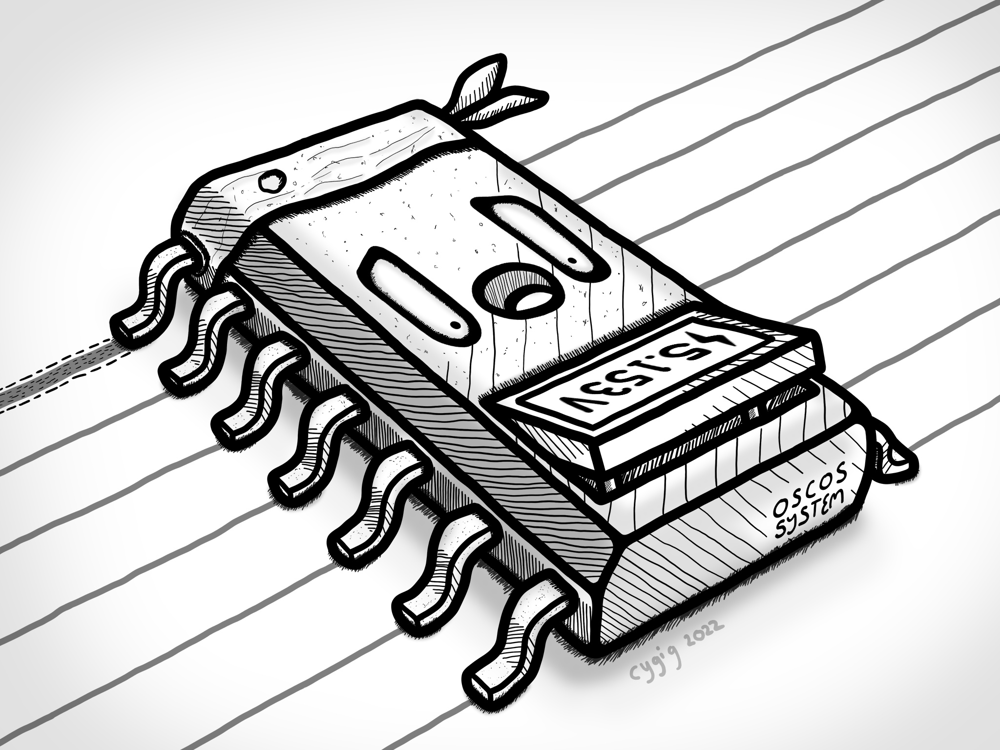

MCUVoltage measures the voltage supply (Vcc) of Arduino without extra components. Supported board includes Uno, Leonardo, Mega as well as the ATtiny 3224/3226/3227. This library also supports oversampling and averaging. Hardware oversampling for the ATtiny 3224/3226/3227 is also supported.

Testing of ATtiny3224 is done on the [megaTinyCore](https://github.com/SpenceKonde/megaTinyCore) by SpenceKonde.

While the Vcc is often assumed to be 5V for the Arduino, it is often not the case. Due to factors like having diode on the power rail, long USB cable, inaccurate bus voltage etc, Vcc can vary, usually between 4.5 to 5.25V.

Since `analogRead()` uses the Vcc as a reference by default, it may be useful to know the actual Vcc instead of making an assumption that it is 5V. 

While the out-of-the-box measurement using this library may not be better than the 5V assumption, this library allows for calibration of the Vcc reading, and is able to achieve consistent results across various USB power supplies. Sadly, needs to be done on a board by board basis. An example, `Calibrate_Bandgap` is included to help with this calibration along with a digital multimeter.

This library is also useful for battery powered projects to read the current battery voltage.

While oversampling of the ADC is supported, this library calculates the result integrally with a precision of up to 1mV, thus excessive oversampling over 13 bits may not be useful.

I will attempt to explain how the ATmega328P ADC, bitmasking and oversampling works, mainly for my own reference. 

## Supported microcontroller units (MCUs):
- ATmega48/88/168/328 and their 'P', 'A', 'PA', 'PB' versions
- ATmega16u4/32u4
- ATmega640/1280/1281/2560/2561
- ATtiny3224/3226/3227

This also means the Arduino Uno, Nano, Leonardo, Micro and Mega are supported.

Since the ATmega48/88/168/328 has so many variants, I did not manage to check the datasheet on all of them, and made the assumption after looking through a few that they should be mostly similar.

The following boards are tested personally by me:
- Arduino Uno Compatible Board
- Arduino Pro Micro Compatible Board
- Arduino Leonardo Compatible Board
- Arduino Mega Pro Compatible Board
- My own ATtiny3224 Development Board
 
See also [byte getDevice()](#byte-getdevice) on how boards and MCUs are detected.

# Contents
- [Updates](#updates)
- [How does It Work?](#how-does-it-work)
- [Notes on ATmega16u4/32u4](#Notes-on-ATMEGA16U432U46401280128125602561)
- [Notes on ATtiny3224/3226/3227](#notes-on-attiny332433263327)
- [Public Functions](#public-functions)
- [Public Functions (ATTINY3224/3226/3227 Exclusive)](#public-functions-ATTINY322432263227-exclusive)
- [Extra: Bitmasking](#extra-bitmasking)
- [Extra: Oversampling](#extra-oversampling)


# Updates
- v0.x.x
  - First upload


# How Does It Work?
For the bulk of the explanation, I will be using the Arduino Uno (ATmega328P) as a reference, as that is something most people are familiar with. Similar concepts apply to the other supported MCUs. ATmega48/88/168, ATmega48P/88P/168P and ATmega328 should have identical ADC as ATmega328P. 

Note that the code presented in this section will not be exactly the same as the source code.

The ATmega328P has a 10-bit (1024 values) Analogue to Digital Converter (ADC) that users can measure one voltage (e.g. pin A0, A1, A2...) against another (Vcc by default). That is done by hooking up a voltage source to one of the analog input pins of the Arduino and call `analogRead()`in the sketch.

However, it is possible to configure the ADC to measure the built-in bandgap voltage against the Vcc. Since the bandgap voltage is often more stable than the Vcc, it is more accurate to assume the bandgap voltage than the Vcc.


## Bandgap Voltage
The bandgap voltage is a voltage reference used by the ATmega328P. Using the black magic of physics, it is possible to create a voltage that is resistance to change due to temperature and the Vcc. While the typical value is 1.1V, the datasheet states that it can be from 1.0 to 1.2V

There are two voltage references in the ATmega328P, the bandgap one and a 1.1V one. It doesn't help that both of them are 1.1V. On page 211 of the datasheet:

> The internal 1.1V reference is generated from the internal bandgap
reference (VBG) through an internal amplifier.

I will be refering to them as `bandgap voltage` and `1.1V voltage reference` to avoid confusion.

The ADC allows you to compare an external voltage source against the 1.1V voltage reference, but only allows you to compare the bandgap voltage against Vcc, and this is how we can back-calculate the vcc.

## Registers
While I cannot find a concrete and easy to understand definition of a register online, I would describe it as a memory reserved for special operations, they are separated from and typically faster than the main memory (RAM).

The ADC has its own set of registers governing its operation. The main ones to take note of is:
- ADMUX (ADC Multiplexer Select)
- ADCSRA (ADC Control and Status Register A)
- ADCL (ADC Data Register Low)
- ADCH (ADC Data Register High)

You can access a register in the Arduino IDE directly using the name (e.g. `ADMUX`, `ADCSRA` etc.) This applies to the ATtiny 3224/3226/3227 using megaTinycore as well.

The Arduino core and built-in functions (like `analogRead()` ) manipulate these registers under the hood, but since what we are doing here is not implemented by Arduino, we need to do it ourselves.

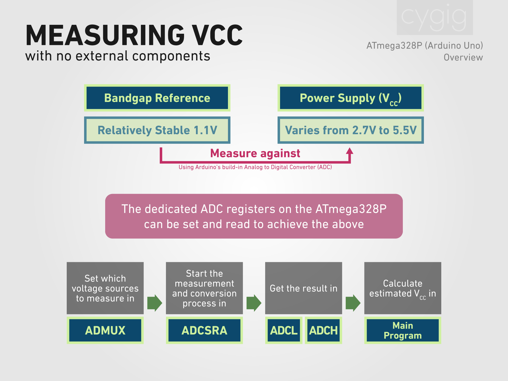

The overall flow goes like this:
1. On ADMUX, select which voltage source is measured against which other one.
2. On ADSCRA, enable the ADC.
3. On ADCSRA, we start the conversion.
4. On ADCSRA, we check the status of the conversion.
5. Once done, we pull the last eight bits (lesser significant) from ADCL.
6. Then we pull the first two bits (more significant) from ADHL.

To manipulate (set, clear, toggle) bits in these registers, we use bitmasking. Check out [Extra: Bitmasking](#extra-bitmasking) in this document to learn about bitmasking.

## ADMUX

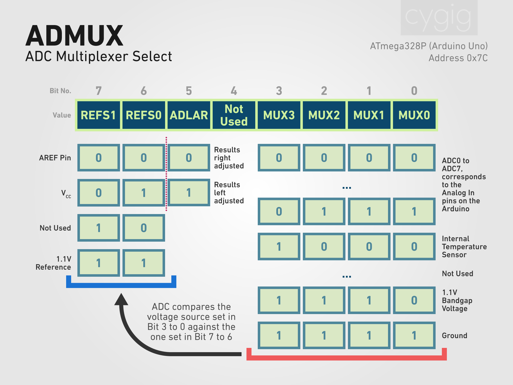

As you can see, each register is one byte or eight bits. Each bits are named and given a number from 7 to 0.

MUX3 to MUX0 set which voltage source is measured against which one. The options are predetermined and presented in the datasheet. So if you want to set the bandgap voltage to be measured against Vcc, we need to set `1110` for MUX3 to 0 and `01` for REFS1 and 0.

ADLAR is used to left or right adjust the results, which we will be leaving it at default (right adjusted). Left adjust is often used to quickly read just the eight most significant bis out of the 10 in ADC conversion result. 

Bit 4 is not used so we will be leaving that alone to. For our bitmask, Bit4 and ADLR will be `00`

We use bitwise OR between the register and a bitmask to set a bit to 1. Check out: [Extra: Bitmasking](#extra-bitmasking).

So the code will be:

`ADMUX |= 0b01001110;`

## ADCSRA
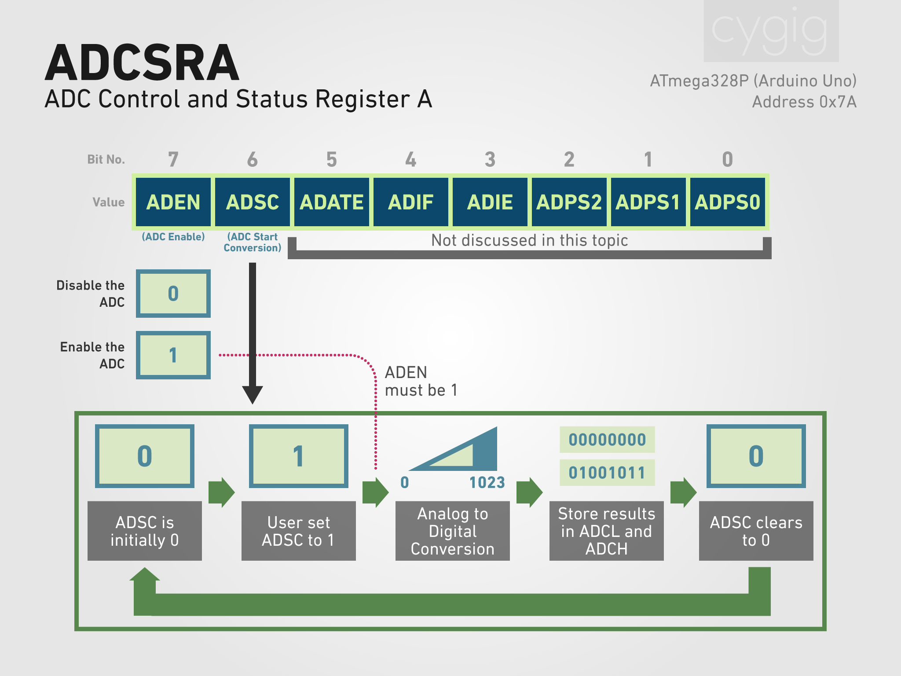

For ADCSRA, we will be focusing on only ADEN (ADC Enable) and ADSC (ADC Start Conversion). Bit 5 to 0 concerns auto triggering, interrupt and prescaling, which we will not be touching and leaving them as default.

ADEN turns on the ADC as a whole when set to `1`.

ADSC starts the ADC conversion when set to `1`, it will then be cleared to `0` once the conversion is completed. The result is stored in ADCL and ADCH.

The code to enable and start the conversion will be:

`ADCSRA |= 0b11000000;`

We will then need a `while` loop to wait for the ADSC to clear to `0`:

`while((ADCSRA&=0b01000000)>0){}`

We use bitwise AND between the register and a bitmask to check the status of a bit. A result of 0 means the bit is `0`, while a result more than 0 means the bit is `1`. Check out: [Extra: Bitmasking](#extra-bitmasking)

You can also use the built-in function to check if ADSC is set like so:

`while (bit_is_set(ADCSRA, ADSC)){}`

## ADCL & ADHL
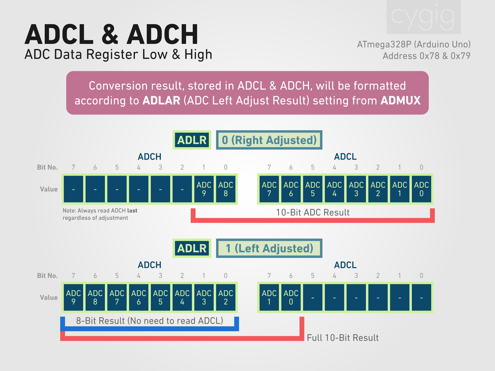

Now that the conversion has ended, we can retrieve our results from the ADCL and ADHL registers. You might have noticed that all the registers so far are eight bits wide, and the ATmega328P ADC has a resolution of 10 bits, which is why the result needs to be stored in two separate register.

The datasheet states that you need to **read ADHL last!**

By default, when ADLAR is `0`, ADCL stores the less significant bits (at the back) while ADHL stores the more significant one (in front).

To store ADCL:

```
// There is only positive result here, thus unsigned
// int in arduino takes two bytes, 16 bits, ample space to
// store our results

unsigned int result = ADCL;
```

To store ADHL:

`result |= ADHL << 8;`

We first shift ADHL by 8 bits to the left, since those spaces were taken by part of the result from ADCL.

Then we use bitwise OR to append the the ones from the right shifted result to first eight bits of the result (which should be zeros).

```
              00000000 00000011  ADCH
Right Shift 8 
              -----------------
              00000011 00000000  Right Shifted ADCH


              00000011 00000000  Right Shifted ADCH
           OR 00000000 01011001  Reading from ADCL
              -----------------
              00000011 01011001  Final result
```

If you set ADLAR to `1`, then what you can do is to only read ADCH, skipping ADCL, and get a 8-bit result instead of 10.

## Calculations

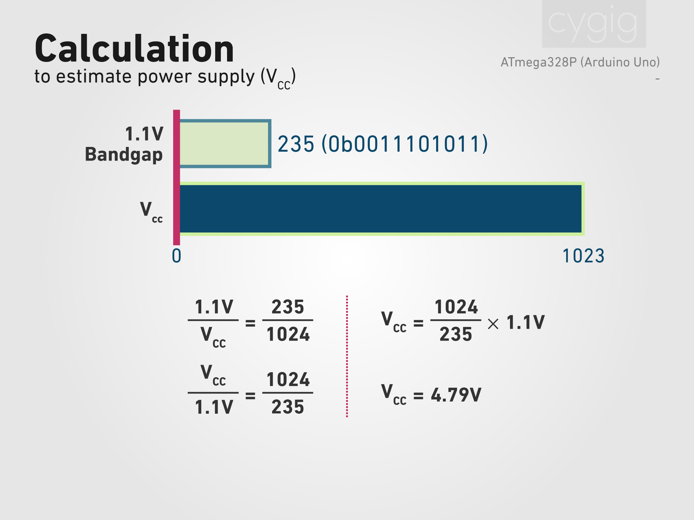

Now that we have the result as an `unsigned int`. Here is now we get Vcc.

Assuming we get as reading of `0b00111010111` or 235 in decimal from the ADC. We know that the maximum reading is for 10 bits is 2^10=1024.

So 235/1024 corresponds to bandgap voltage/Vcc. We know that bandgap is supposed to be 1.1V, rearranging the equation as shown in the graphics above, we can get Vcc = 4.79V.
 
Side note: While there are debates online if the divisor is 1023 or 1024, page 215 of the datasheet mentions 1024. I would also like to think that each discreet value produces by the ADC represents a **range** of continuous analogue values, thus for a 5V reference, each value represents a range of `5/1024=0.0048828125V`. A value of 1023 means the range starts from `1023/1024*5=4.9951171875V` and ends at `4.9951171875+0.0048828125=5V`.


# Notes on ATmega16u4/32u4/640/1280/1281/2560/2561
## Differential readings
These MCUs supports differential voltage measurement but will not be used in this library.

## Different ADMUX
While the rest of the operations are identical to ATmega328P, the ADMUX register takes 6 bits (MUX 5 to 0) for the incoming voltage selection. To select the bandgap voltage, set `11110`. There is no unused bit. Note that Bit-5 is stored inside ADCSRB and the position is different between 16u4/32u4 and 640/1280/1281/2560/2561.

# Notes on ATtiny3224/3226/3227
## New features
The ATtiny3224/3226/3227 has a 12-bit ADC instead of a 10-bit one on ATmega328P. It also has a built-in programmable gain amplifier (PGA) to amplify the incoming voltage. It supports hardware oversampling with calculations mostly automated on the chip. It also supports differential voltage measurement.

## Reference voltage
The bandgap voltage is not available for comparison, only one of the four generated voltage reference (1.024V, 2.056V, 2.500V, 4.096V). This library will still call it bandgap voltage for consistency sake.

## Addressing the registers
The registers are accessed by ADCn.Register, where n is the ADC number and Register is the name of the register to access. There is only one ADC, thus it n is always 0.

## Operation flow
While the general concept to use the ADC remains the same, the name of the registers and functionality has changed. If you are able to follow through the steps for ATMega328P, then you should have no problem reading the datasheet of ATtiny 3224/3226/3227 to figure out the details.

The general operation flow:

1. Set the reference voltage to 1.024V by clearing VREF.CTRLA 
2. Set AC0.DACREF to 256 so the ADC will use 100% of the 1.024V reference voltage
3. Enable the ADC by setting ENABLE (Bit 0) at ADC0.CTRLA to `1`.
4. Select the incoming voltage source of 1.024V reference by setting Bit 5 to 0 at ADC0.MUXPOS to `110011` (0x33).
5. Clear ADC0.CTRLF to disable freerun and left adjust, and setting the ADC to accumulating only a single sample
6. Select the reference voltage source of Vcc by setting REFSEL (Bit 2 to 0) at ADC0.CTRLC to `000`.
7. Select the mode of a single 12-bit conversion by setting MODE (Bit 6 to 4) at ADC0.COMMAND to `001`.
8. Start the conversion immediately by setting START (Bit 2 to 0) at ADC0.COMMAND to `001`.
9. Wait for ADC0.STATUS become `0`, indicating the conversion ended.
7. Read the less significant eight bits of result from ADC0.RESULT0.
8. Read the more significant four bits of the result from ADC0.RESULT1 and right shift it by eight.
9. Bitwise OR the two parts of the result to get the final 12-bit result.

## Hardware Oversampling
This line of MCU supports automated accumulation and scaling of readings. While it can burst read and accumulate different numbers of samples, it can only scale to 16 bits by rightshifting (essentially the decimating part of oversampling) if the maximum possible accumulated result is more than 16 bits.

As such, the ADC is the most automated when oversampling to 16 bits. For any other oversampled bit depth, the decimation part needs to be done the regular software way.

I am also not sure if this really constitutes to "hardware oversampling" and if it is faster than software implementation.

# Public Functions

## MCUVoltage()
Constructor, this assumes the default bandgap voltage.

## MCUVoltage(*unsigned int* myBandgap)
Constructor, where you pass your own bandgap voltage, `myBandgap`. Note that `myBandgap` is in millivolts. This is also meant to calibrate the accuracy of the readings. While the bandgap voltage may not be accurate on production, it should remain more or less consistent across different working environments, thus knowing your bandgap voltage will mean future readings should be accurate. An example is provided to calculate this bandgap voltage with the help of a digital multimeter. This is known as the reference voltage for ATtiny3224/3226/3227.

## *unsigned long* readmV()
Returns Vcc in millivolts. This function only read the Vcc once, and is not recommended as we usually discard the first reading, however this can be useful if you want to read multiple times manually. This is faster than `read()` since there are no floating point operation. 

## *unsigned long* readmV(*byte* avgTimes)
Returns Vcc in millivolts. Read the Vcc once, discard that reading, then go on and read `avgTimes` more, and returns the averaged the results.

## *float* read()
Similar to `readmV()` but returns the result in volts rather than millivolts, as a floating point, thus also slower.

## *float* read(*byte* avgTimes)
Similar to `readmV(byte avgTimes)` but returns the result in volts rather than millivolts, as a floating point, thus also slower.

## *unsigned long* getLastADCReading()
Get the last ADC reading of the bandgap voltage as input against the Vcc as reference.

## *unsigned int* getBandgap()
Get the current bandgap voltage in use. Returned value is in millivolts.

## *byte* getBitDepth()
Get the native bitdepth of the ADC. It should either 12 (bits) for ATtiny3224/3226/3227 and 10 (bits) for other supported MCU.

## *unsigned int* getResolution()
Get the resolution of the ADC. 10-bit ADC should return 1024, 12-bit one should return
4096. This is also the precision of the ADC.

## *byte* getMode()
Get the operation mode. Mode is only updated after calling 
- `read()`
- `read(byte avgTimes)`
- `readmV()`
- `readmV(byte avgTimes)`
- `read_OS(byte targetBitDepth)`
- `read_OS(byte targetBitDepth, byte avgTimes)`
- `readmV_OS(byte targetBitDepth)`
- `readmV_OS(byte targetBitDepth, byte avgTimes)`
- `read_HWOS(byte targetBitDepth)`
- `read_HWOS(byte targetBitDepth, byte avgTimes)`
- `readmV_HWOS(byte targetBitDepth)`
- `readmV_HWOS(byte targetBitDepth, byte avgTimes)`

| Value | Mode Definition       |
|-------|-----------------------|
| 0     | REGULAR_READING       |
| 1     | SOFTWARE_OVERSAMPLING |
| 2     | HARDWARE_OVERSAMPLING |

## *byte* getDevice()
Get the device the library is running on.

| Value | Device Definition | Device Description                         | MCU                  |
|-------|-------------------|--------------------------------------------|----------------------|
| 0     | UNKNOWN_DEVICE    | Unknown                                    | Unknown              |
| 1     | A_UNO             | Arduino Uno and its compatible boards      | ATmega328/328P/328PB |
| 2     | A_LEO             | Arduino Leonardo and its compatible boards | ATmega32U4           |
| 3     | A_MEGA            | Arduiono Mega and its compatible boards    | ATmega2560           |
| 4     | ATTINY322X        | Any board with ATtiny3224/3226/3227        | ATtiny3224/3226/3227 |

Note that unknown devices can include less common MCUs:
- ATmega16u4, where the library will detect and treat it similarly to ATmega32u4.
- Atmega640/1280/1281/2561, where the library will detect and treat it similarly to ATmega2560.

Any other unknown boards will be treated as a ATmega328P during operations.

## *bool* setBandgap(*unsigned int* myBandgap)
Set the bandgap voltage use, in millivolts. Returns `true` on success, else returns `false` and the default bandgap value will be used. The operation will be deemed a failure if `0` is being passed, and this can be used to set the bandgap voltage back to default. 

## *void* ADCSetup()
Setup the ADC for a reading. Always call this before `readADC()`. Used internally for the other functions that read Vcc.

## *unsigned int* readADC()
Read the ADC where the bandgap voltage is the input and the Vcc is the reference once. Call `ADCSetup()` first. Used internally for the other functions that read Vcc.

## *unsigned long* readmV_OS(*byte* targetBitDepth)
Returns Vcc in millivolts after software oversampling to `targetBitDepth`. This function only reads the exact number of times needed to oversample, and is not recommended as we usually discard the first reading, however this can be useful if you want to read multiple times manually. This is faster than `read_OS(byte targetBitDepth)` since there are no floating point operation. 

While there is no check on how many bits are being oversampled, oversampling to more than 13 bits usually has diminishing returns and takes a long time, refer to `readmV_OS(byte targetBitDepth, byte avgTimes)`for more information.

`targetBitDepth` needs to be higher than the ADC's native bitdepth (see `getBitDepth()`).

## *unsigned long* readmV_OS(*byte* targetBitDepth, *byte* avgTimes)
Returns Vcc in millivolts after software oversampling to `targetBitDepth`. Read the Vcc once, discard that first reading. Go on and read enough times more to oversample. Then repeat oversampled readings for `avgTimes` more, and returns the averaged the results.

While there is no check on how many bits are being oversampled, oversampling to more than 13 bits usually has diminishing returns and takes a long time. 

Two `unsigned long` variables are used, one to store the oversampling sum, and one to store the averaging sum, thus if `targetBitRate` or `avgTimes` is too large, those variables will overflow. The number of averaging time is also limited by the `byte` datatype used and the number of results to sample is limited by `unsigned int` datatype used.

`targetBitDepth` needs to be higher than the ADC's native bitdepth (see `getBitDepth()`). `avgTimes` needs to be between 1 and 255, inclusive.

Check out [Extra: Oversampling](#extra-oversampling) to see how the calculation works.

| Data Type    | Bytes | Range             |
|--------------|-------|-------------------|
| byte         | 1     | 0 to 255          |
| unsigned int | 2     | 0 to 65,535       |
| unsigned long| 4     | 0 to 4,294,967,295|

Keep the oversampling bitdepth and averaging times within these values in the table below to prevent overflowing.

ATtiny3224/3226/3227:

| Native Bit Depth | Native Resolution |
|------------------|-------------------|
| 12               | 4,096             |


| Oversampled Bit Depth | Extra Bits | Samples Needed | Max Sum of Samples | Max Averaging Allowed | Max Sum of Averaging |
|--|-|------|----------|---|-------------|
|13|1|4     |16,384    |255|4,177,920    |
|14|2|16    |65,536    |255|16,711,680   |
|15|3|64    |262,144   |255|66,846,720   |
|16|4|256   |1,048,576 |255|267,386,880  |
|17|5|1,024 |4,194,304 |255|1,069,547,520|
|18|6|4,096 |16,777,216|255|4,278,190,080|
|19|7|16,384|67,108,864|63 |4,227,858,432|

Other supported MCU (ATmega328P/32u4/2560 etc):

| Native Bit Depth | Native Resolution |
|------------------|-------------------|
| 10               | 1,024             |


| Oversampled Bit Depth | Extra Bits | Samples Needed | Max Sum of Samples | Max Averaging Allowed | Max Sum of Averaging |
|--|--|------|----------|---|-------------|
|11|1 |4     |4,096     |255|1,044,480    |
|12|2 |16    |16,384    |255|4,177,920    |
|13|3 |64    |65,536    |255|16,711,680   |
|14|4 |256   |262,144   |255|66,846,720   |
|15|5 |1,024 |1,048,576 |255|267,386,880  |
|16|6 |4,096 |4,194,304 |255|1,069,547,520|
|17|7 |16,384|16,777,216|255|4,278,190,080|


## *float* read_OS(*byte* targetBitDepth)
Similar to `readmV_OS(byte targetBitDepth)` but returns the result in volts rather than millivolts, as a floating point, thus also slower.


## *float* read_OS(*byte* targetBitDepth, *byte* avgTimes)
Similar to `readmV_OS(byte targetBitDepth, byte avgTimes)` but returns the result in volts rather than millivolts, as a floating point, thus also slower.

## *byte* getBitDepth_OS()
Get the software oversampled bitdepth. `ADCSetup_OS(byte targetBitDepth)` or another function that calls `ADCSetup_OS(byte targetBitDepth)` needs to be called first before the relevant properties are updated.

## *unsigned long* getResolution_OS()
Get the software oversampled resolution. `ADCSetup_OS(byte targetBitDepth)` or another function that calls `ADCSetup_OS(byte targetBitDepth)` needs to be called first before the relevant properties are updated.

## *byte* getExtraBits_OS()
Get how many bits are being software oversampled. `ADCSetup_OS(byte targetBitDepth)` or another function that calls `ADCSetup_OS(byte targetBitDepth)` needs to be called first before the relevant properties are updated.

## *unsigned int* getSampleCount_OS()
Get how many times the ADC need to be read for software oversampling. `ADCSetup_OS(byte targetBitDepth)` or another function that calls `ADCSetup_OS(byte targetBitDepth)` needs to be called first before the relevant properties are updated.

## *void* ADCSetup_OS(*byte* targetBitDepth)
Setup the ADC for a software oversampled reading. Always call this before `readADC_OS()`. Used internally for the other functions that read software oversampled Vcc.

## *unsigned long* readADC_OS()
Read the ADC with software oversampling where the bandgap voltage is the input and the Vcc is the reference once. Call `ADCSetup_OS()` first. Used internally for the other functions that read software oversampled Vcc.

# Public Functions (ATtiny3224/3226/3227 Exclusive)

## *unsigned long* readmV_HWOS(*byte* targetBitDepth)
Returns Vcc in millivolts after hardware oversampling to `targetBitDepth`. This function only reads the exact number of times needed to oversample, and is not recommended as we usually discard the first reading, however this can be useful if you want to read multiple times manually. This is faster than `read_HWOS(byte targetBitDepth)` since there are no floating point operation.

`targetBitDepth` needs to be between 13 and 17, inclusive. Else it will default to 16 since that is the only scaling option provided by the MCU.

## *unsigned long* readmV_HWOS(*byte* targetBitDepth, *byte* avgTimes)
Returns Vcc in millivolts after hardware oversampling to `targetBitDepth`. Read the Vcc once, discard that first reading. Go on and read enough times more to oversample using the burst accumulation function of the MCU. Then repeat oversampled readings for `avgTimes` more, and returns the averaged the results.

`targetBitDepth` needs to be between 13 and 17, inclusive. Else it will default to 16 since that is the only scaling option provided by the MCU. `avgTimes` needs to be between 1 and 255, inclusive.

## *float* read_HWOS(*byte* targetBitDepth)
Similar to readmV_HWOS(byte targetBitDepth) but returns the result in volts rather than millivolts, as a floating point, thus also slower.

## *float* read_HWOS(*byte* targetBitDepth, *byte* avgTimes)
Similar to `readmV_HWOS(byte targetBitDepth, byte avgTimes)` but returns the result in volts rather than millivolts, as a floating point, thus also slower.

## *byte* getBitDepth_HWOS()
Get the hardware oversampled bitdepth. `ADCSetup_HWOS(byte targetBitDepth)` or another function that calls `ADCSetup_HWOS(byte targetBitDepth)` needs to be called first before the relevant properties are updated.

## *unsigned long* getResolution_HWOS()
Get the hardware oversampled resolution.`ADCSetup_HWOS(byte targetBitDepth)` or another function that calls `ADCSetup_HWOS(byte targetBitDepth)` needs to be called first before the relevant properties are updated.

## *byte* getExtraBits_HWOS()
Get how many bits are being software oversampled. `ADCSetup_HWOS(byte targetBitDepth)` or another function that calls `ADCSetup_HWOS(byte targetBitDepth)` needs to be called first before the relevant properties are updated.

## *void* ADCSetup_HWOS(*byte* targetBitDepth)
Setup the ADC for a hardware oversampled reading. Always call this before readADC_HWOS(). Used internally for the other functions that read hardware oversampled Vcc.

## *unsigned int*  readADC_HWOS()
Read the ADC with hardware oversampling where the bandgap voltage is the input and the Vcc is the reference once. Call ADCSetup_HWOS() first. Used internally for the other functions that read hardware oversampled Vcc.


# Extra: Bitmasking

Imagine our data as a string of bits, which we call bitstring. This can be data from registers or other parts of the program.

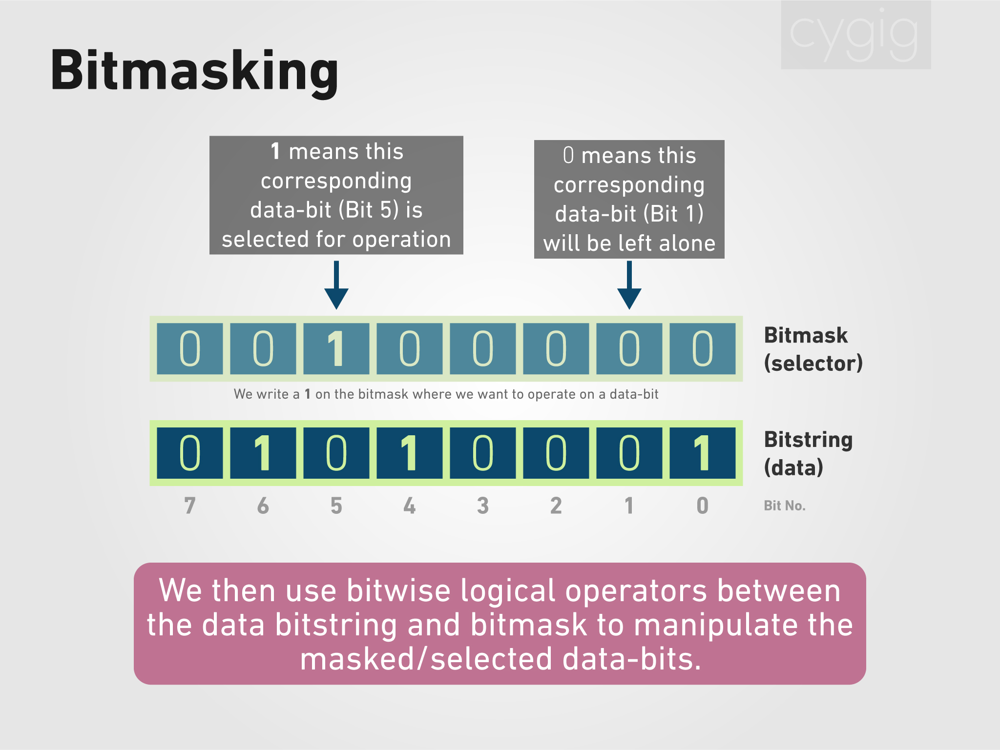

We can use bitmasking to manipulate certain bits in this bitstring. A bitmask acts as a selector to our data, where a `1` denotes that the corresponding data-bit needs to be operated on and a `0` denotes the bit be left alone.

## Basic bitwise operators
To do so, we use some basic bitwise operators as shown below:

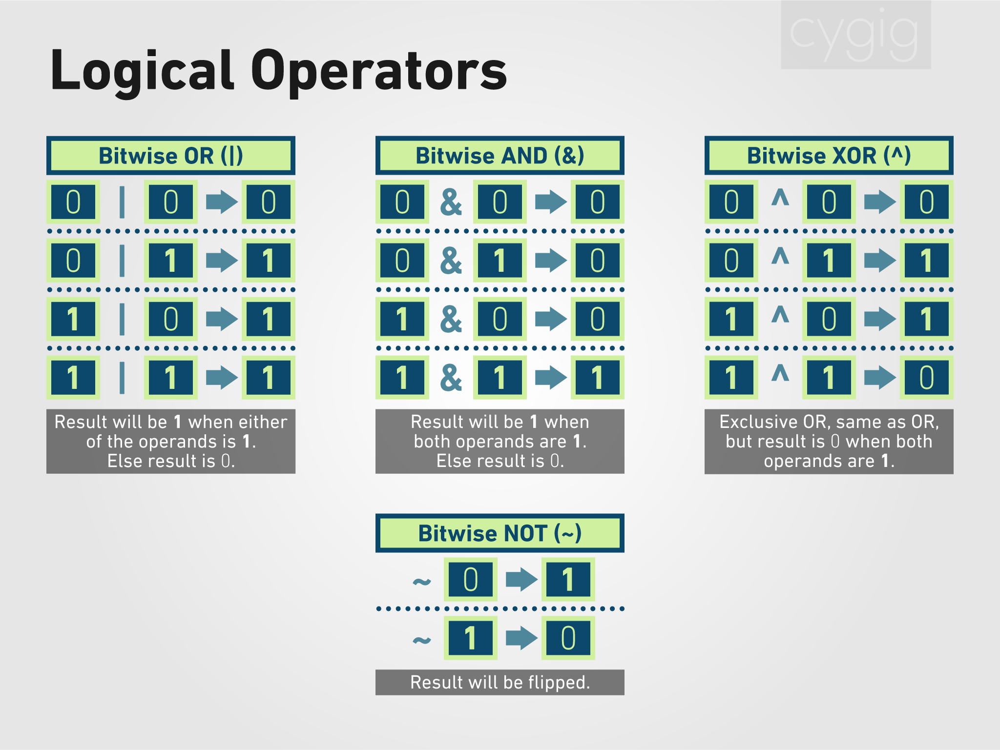


## Setting bits

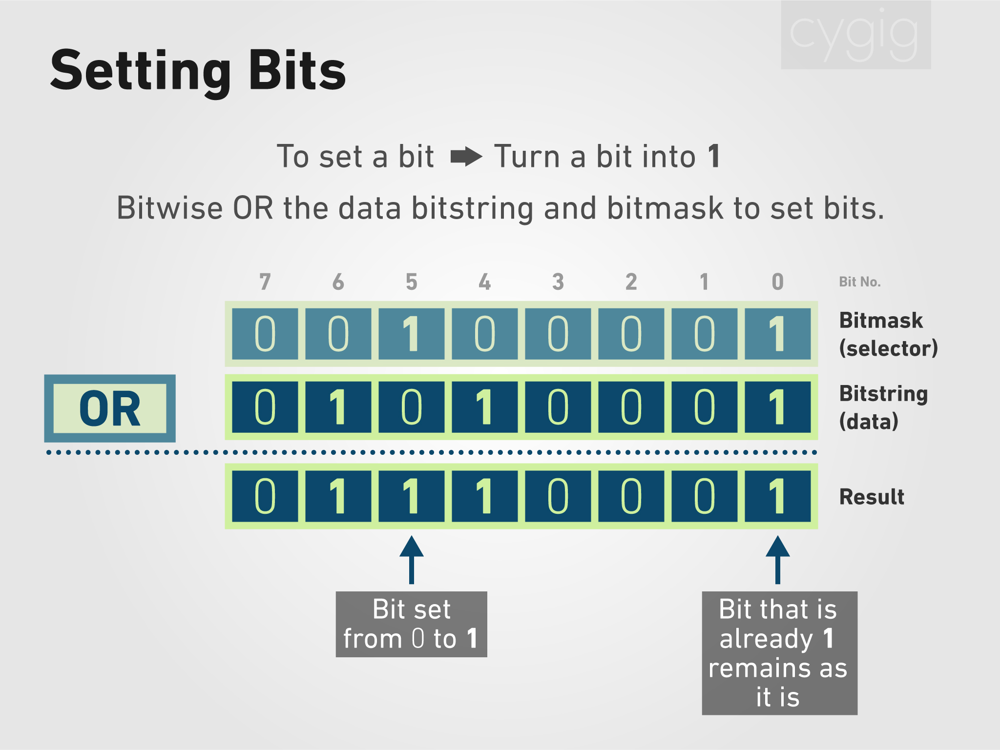

To set a bit is to turn it `1` regardless of the original content, we use the bitwise OR operator between the data and the bitmask.

In C++ :
```
//We use prefix a number with 0b to denote we are writing in binary
// Instead of unsigned int, we can use uint8_t as well
unsigned int data = 0b01010001; 
data = data | 0b00100001;
 
```

We can write in shorthand form:
```
unsigned int data = 0b01010001;
data |= 0b00100001;
```


## Clearing bits
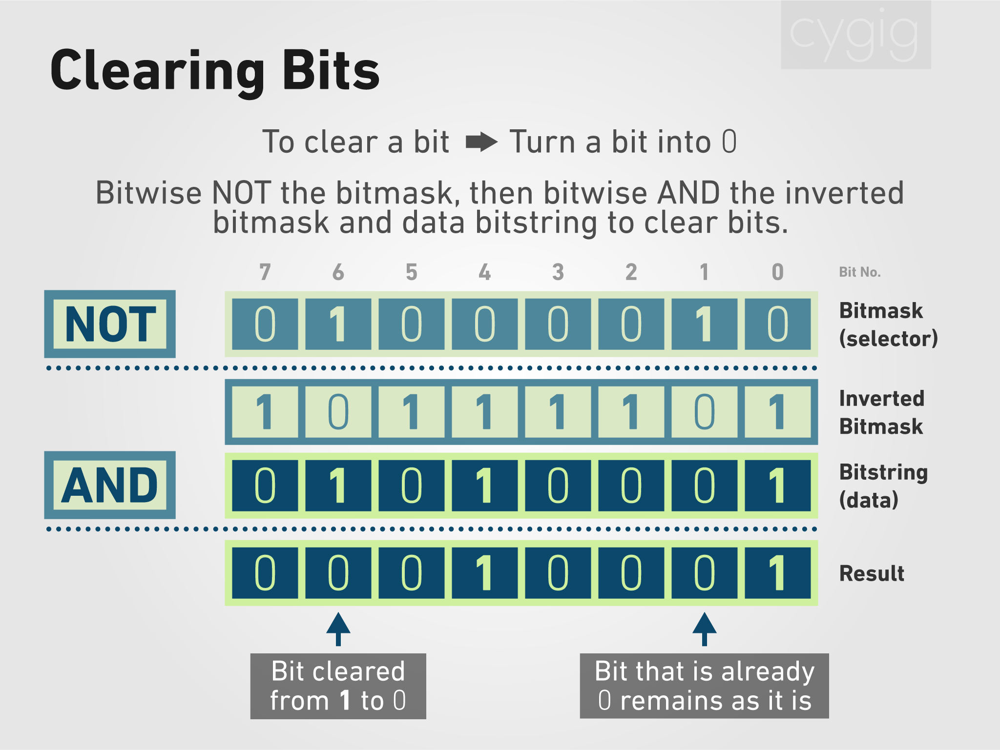

To clear a bit is to turn it `0` regardless of the original content. This is a little more complicated. There are a few ways to do it, then one shown here is to NOT the bitmask to get an inverted bitmask. Then AND the inverted bitmask with the data.

In C++ :
```
unsigned int data = 0b01010001;
target &= ~(0b01000010);
```

We can also manually NOT the bitmask to save some computing time:

```
unsigned int data = 0b01010001;
target &= 0b10111101;
```

## Toggling bits

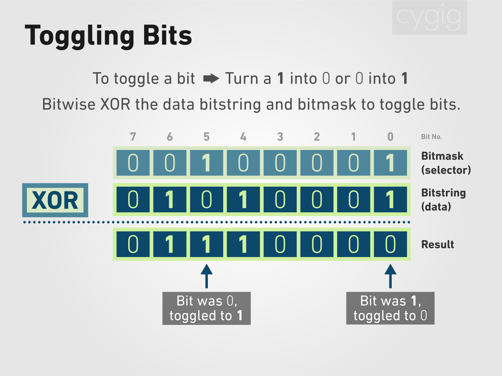

To toggle a bit is to invert it. A `1` will become a `0`, while a `0` becomes A `1`. We use bitwise XOR between data and the bitmask.

In C++ :
```
unsigned int data = 0b01010001;
data ^= 0b00100001;
````


## Reading a bit

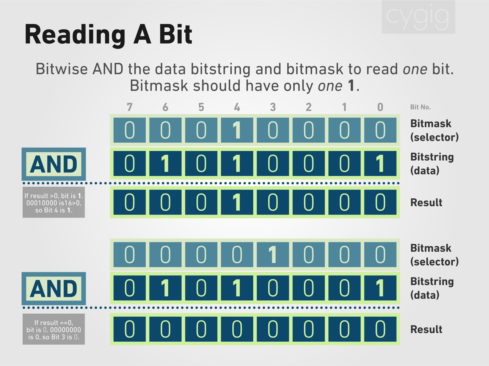

To read one single bit, we use bitwise AND between data and bitmask. Note that in this case, there can be only one `1` inside the bitmask. Using this method, we can only check one bit at a time.

If the result is more than zero, then the selected data-bit is `1`, else it is `0`.

In C++ :
```
unsigned int data = 0b01010001;

if ((data & 0b00010000) > 0)
{
// Do stuff when Bit 4 is 1
}
```

We can also check if Bit 3 is `0`:

```
if ((data & 0b00001000) == 0)
{
// Do stuff when Bit 3 is 0
}
````


## Reading many bits
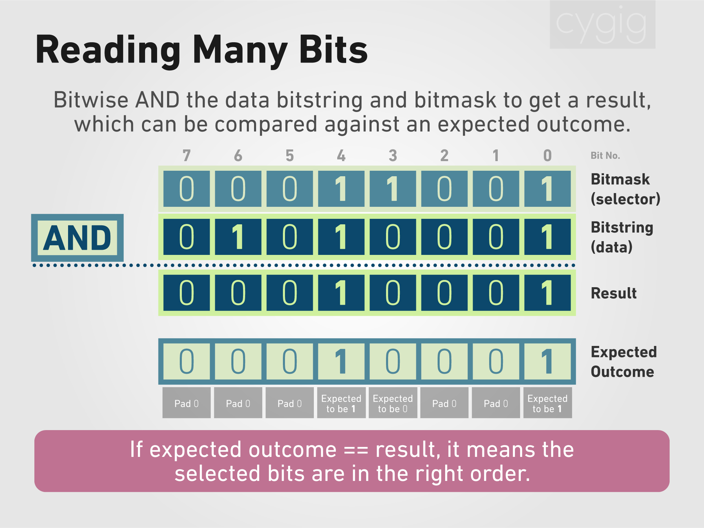

The previous method can be used repeatedly to check each and every bit. However, we can also check if a group of multiple bits are in the correct order (correct `1`s and `0`s).

To do this:
1. Make a bitmask selecting those bits we want to check
2. Form an expected outcome
3. Bitwise AND the data and the bitmask
4. Compare the result to see if it matches the expected outcome

If the expected outcome matches the result, then the selected data-bits are in the correct order.

To form the expected outcome:
1. Write down the expected bits at the correct position
2. Pad the rest with `0`s

In C++:

```
unsigned int data = 0b01010001;
unsigned int expected = 0b00010001;

if ((data & 0b00011001) == expected)
{
// Do stuff when Bit 4 is 1, Bit 3 is 0 and Bit 0 is 1
}
```

We can observe from the graphic and example code that once Bit 4, 3 and 0 changes, the expected outcome will no longer be `00010001`.

If we want to compare the entire bitstring, we can simply use the EQUAL operator:

```
unsigned int data = 0b01010001;

if ( data == 0b01010001)
{
// Do stuff when data is in the correct order
}
```


# Extra: Oversampling

In the case of the Arduino Uno (ATmega328P), readings by the ADC will be of 10-bit precision, ranging from 0-1023. Assuming we are measuring against 5V, this result in each value representing around a range of 0.00488V. Any measurement falling within this precision will be rounded off. To oversample is to increase this precision by taking more readings.

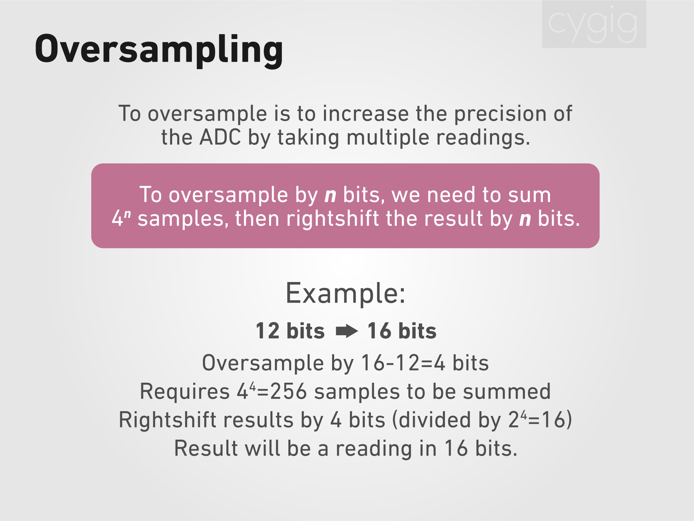

To get *n* more bits of precision, we need to take 4^*n* samples, sum them up and rightshift the result by *n*, effective diving it by 2^*n*. You can see an example given in the graphic above.

Let's take an even simpler example and walk through step by step. 

Assume we are feeding 3.8V into an ADC channel in the Arduino, to be compared against its Vcc of exactly 5.0V. We measure 778 using `analogRead()` and we want to increase the precision.

778 will correspond to a range of 778  / 1024 * 5.0 = 3.799V. More accurately, 3.799V to 3.799 + 0.00488V.

We oversample from 10 bit to 12 bit, oversampling by 12 - 10 = 2 bits. We need to do 4^2 = 16 readings. Apparently, some noise is needed for oversampling to work, and assume we get the following 16 readings:

```
778 777 779 780 778 781 776 777
780 776 777 780 778 778 776 781
```

We add all 16 values up to get 12,452, or `0011000010100100`. We rightshift by 2 to get `0000110000101001` or we can divide 12,452 by 2^2 = 4, which gives 3,113.

3,113 will be the oversampled 12-bit reading. A 12-bit reading ranges from 0-4095, and on a 5V reference, each value represents around a range of 0.00122V.

3,113 will correspond to a range of 3113 / 4096 * 5.0 = 3.800V, more accurately, 3.800V to 3.800V+0.00122V, which is of a higher precision than before. 

Do note that oversampling does not increase the accuracy of the ADC. 